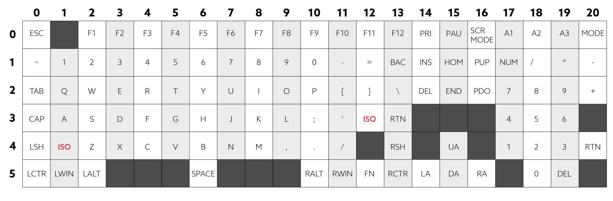

# Wooting RGB SDK

Customize RGB colors on your Wooting Keyboard for developers and hobbyists.

## Getting Started

This project will allow you to build your own DLL and customize the source code. Looking to directly get started with the DLL? Check out the downloads and guides in our [developer portal](https://dev.wooting.io).

### Prerequisites

#### Windows

[Visual studio](https://visualstudio.microsoft.com/)

#### Linux

Dependencies:

```
libusb-1.0, libusb-dev, hidapi, libhidapi-dev
```

Additionally, you will need `pkg-config`, `git`, `make` and `gcc` to compile the Library.

#### Mac

Dependencies: `hidapi`, `make`, `pkg-config`, `gcc` (or `clang` through `xcode`)
If you have [homebrew](https://brew.sh/) set up then this command should get you sorted with most dependencies:

```
brew install automake pkg-config hidapi
```

## Building / Installing

### Debugging

You can add `DEBUG_LOG`to the preprocessor flag to build with debug logs enabled. For Linux / Mac add:

```
make CPPFLAGS=-DDEBUG_LOG
```

### Instructions

#### Windows

```
git clone --recursive https://github.com/WootingKb/wooting-rgb-sdk.git
```

Open the visual studio project and select x64 (64-bit) or x86 (32-bit).

Now hit the build and find your DLL in the folder depending on your configuration.

64-bit

```
\wooting-rgb-sdk\windows\x64\Release\wooting-rgb-sdk.dll
```

32-bit

```
\wooting-rgb-sdk\windows\Release\wooting-rgb-sdk.dll
```

#### Linux

Clone the Git Repository:

```
git clone https://github.com/WootingKb/wooting-rgb-sdk.git
```

Change into the Linux Directory using `cd wooting-rgb-sdk/linux` and simply run `make`.

If you wish to use the Library yourself it might be useful to install it to your System. Do so with `sudo make install`

#### Mac

Clone the Git Repository:

```
git clone https://github.com/WootingKb/wooting-rgb-sdk.git
```

Change into the Mac Directory using `cd wooting-rgb-sdk/mac` and simply run `make`.

If you wish to use the Library yourself it might be useful to install it to your System. Do so with `sudo make install`

## Example

For examples check out the [wootdev website](https://dev.wooting.io).

## Keyboard Matrix

Keyboard matrix with rows and columns:


## License

This project is licensed under the Mozilla Public License Version 2.0 - see the [LICENSE](LICENSE) file for details.
